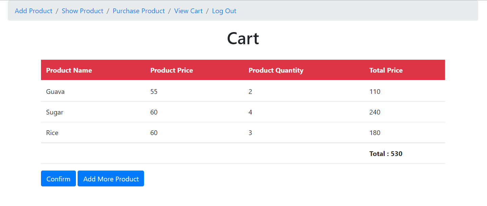

# Point Of Sale System

 This is a simple web-based open source software written in PHP and MySQL. This was specifically written for Point of Sale. You can easily install this system in your own server.

 If you find any bug feel free to send a pull request. 
 

 If you have any suggestions feel free create issues. 

<ul>
    <li>
        <a href = "https://github.com/MdJusef/POS-System#Installation">Installation</a>
    </li>
    <li>
        <a href = "https://github.com/MdJusef/POS-System#Purpose">Purpose</a>
    </li>
    <li>
        <a href = "https://github.com/MdJusef/POS-System#goals-and-objectives">Goals and Objectives</a>
    </li>
    <li>
        <a href = "https://github.com/MdJusef/POS-System#project-description">Project Description</a>
    </li>
    <li>
        <a href = "https://github.com/MdJusef/POS-System#database-e-r-diagram">Database E-R Diagram</a>
    </li>
    <li>
        <a href = "https://github.com/MdJusef/POS-System#processes">Processes</a>
    </li>
    <li>
        <a href = "https://github.com/MdJusef/POS-System#technology">Technology</a>
    </li>
</ul>

## Installation
The web application is a simple implementation of Point of Sale System using Php and Mysql.
To successfully run the web application you must follow these steps:
 
<ol>
    <li>Download and Install xampp.</li>
    <li>After Installing, Copy and Paste the whole folder 'project'  to this directory: C:\xampp\htdocs</li>
    <li>Open Xampp program and then start Apache and Mysql.</li>
    <li> Click on "Admin" button of "Mysql". Your Browser will open and you will be redirected to phpmyadmin page.</li>
    <li>Create a new database with exactly the same name as the <pos_system.sql> file situated at 
        location C:\xampp\htdocs\project</li>
    <li>Click on "Import" tab. From the browse option click on choose file and select <testdb.sql> file 
        from location C:\xampp\htdocs\project. 
        Finally, Scroll down and click on go.</li>
    <li>Now open a browser and in address bar, type: localhost/project</li>
    <li>Enter some information for several time to get started and check.</li>
    <li>I hope you like it!</li>
</ol>

## Purpose

The purpose of the Point-of-Sale system is to keep track of sales and calculate items price easily.
A point-of-sale system used to refer to the cash register at a store. Besides A pos system 
calculates the price of the item, and then updates the inventory count to show that the item is sold.

## Goals and Objectives

 The goals and objectives of the Point of Sale system are as follows: 

<ul>
  <li>For accessing store sale’s history and analytics in one place, we need point of sale system.</li>
  <li>To provide instant pricing and faster checkout</li>
  <li>Filtering reports by price or date</li>
  <li>Proper use of Point-of-sale systems will save you time that you can use in others area for growing another business.</li>
  <li>For tracking operator sales report easily</li>
</ul>

## Project Description

The system that is going to be developed is Point of Sale System. This is a web-based software 
where you can keep track your sales. And you can easily calculate the price of the item, and then 
update the item is sold. You can add product and purchase product for customer. After purchase,
billing report will be generated. Operator can add, delete, and update product.

## Scope

As a whole the system is focused to work with Point-of-sale system and on additional modification
it can be also used as Sale system of similar organizations.

## System Users
<ul>
  <strong><li>Administrators:</strong> Has full privilege on the system's functions</li></strong>
  <strong><li>Operator:</strong> Has privilege on the system's functions as assigned by theadministrator</li></strong>
</ul>

## Database E-R Diagram

## Processes
<ul>
  <li><strong>Admin Login:</strong>
The system provides security features through username-password matching 
where only authorized admin can access the system with different authorization level.

  
  
  </li>

  <li><strong>Operator Login:</strong>
Admin can create operator username and password. Operator only can 
access their panel using admin operated password and username.

  
  </li>

  <li><strong>Operator Dashboard:</strong>
After successful login , operator login panel will show.

  
  </li>

  <li><strong>Add Product: </strong>
Admin have access in all features, but operator have not. Operator can add 
product.

  
  </li>

  <li><strong>Show Product: </strong>
After successful product insertion, we can see product from database.
 

  
  </li>
 
 <li><strong>Purchase Product for Customer: </strong>
Operator also purchase product for customer with differrent features

  
  </li>
 
  <li><strong>Add To Cart: </strong>
Operator can add to cart. And immediately it will show the cart page. it will
dynamically calculate total price. Operator will also add more than one product. After click on
click on confirm button, it will automatically generate print slip for customer.

  
  </li>

<li><strong>Add Operator: </strong>
Admin can add operator username and password.

  
  </li>
 
</ul>

## Technology
<strong>Frontend Language:Bootstrap, Css, Html </strong>  
<strong>Backend Language:Php, MySql </strong> 
